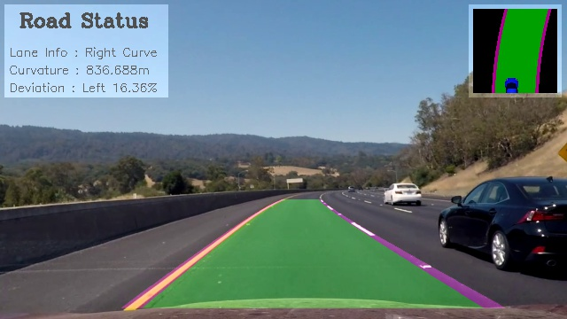

# Udacity Advanced Lane Finding Project

     
    <b>result image</b> 

The goals this project are to

- Recalibrate the camera
- Correct the distortion in raw images
- Use color transforms and gradients to create a binary image
- Detect lane lines
- Determine the curvature of the lane and vehicle position with respect to center.

## Pipeline

- When a camera looks at 3D objects in the real world and transforms them into a 2D image, it's not perfect because of a distortion. And the distortion brings an erroneous information.(e.g. changed object shape, bent lane lines) So, we have to undo the distortion for getting useful data.

- In image, a bonnet and background are not necessary to find lane lines. Therefore, I cropped the inconsequential parts.

- Here, I used two approaches to find lane lines. a **Gradient** approach and a **Color** approach.

- We can assume the road is a flat plane. Pick 4 points of straight lane lines and apply perspective transform to the lines look straight. It is also called `Bird's eye view`.

- In my output video, I included some road informations.

## Result

